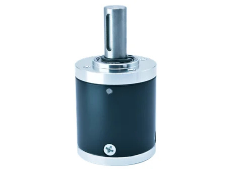

# 36 mm Compact Precision Planetary Gearhead (36P)

## Downloads

| File | Status |
| --- | --- |
| Online datasheet | [Open 36P datasheet](../../engineering-resources/36p/datasheet.md) |
| 2D drawing PDF | Source identified; public binary upload pending |
| Full assembly STEP | Source identified; public binary upload pending |
| Dimension preview | [View mechanical interface](../../engineering-resources/36p/mechanical-interface.md) |
| Simplified STEP | [Download 4-stage reference](../../assets/downloads/36p/36P_Public_Simplified_STEP_v1.0_4-Stage.step) |

## Product Specifications

## Product Identity

| Item | Description |
| --- | --- |
| Model | 36P |
| Product type | Compact precision planetary gearhead (planetary gearbox) |
| Nominal outer diameter | 36 mm |
| Number of stages | 1 to 4 |
| Housing material | Steel |
| Gear material | Steel |
| Output bearing | Ball Bearing |
| Manufacturing process | Machining |

## Key Specifications

| Parameter | Published value |
| --- | ---: |
| Nominal outer diameter | 36 mm |
| Gearhead length range | 30.6–61.5 mm |
| Reduction ratio range | 3.66:1–625:1 |
| Rated allowable torque range | 3922.7–9806.6 mN·m |
| Maximum momentary torque range | 7845.3–19613.3 mN·m |
| Efficiency range | 66–90% |
| Backlash at no load | ≤ 1.2° |
| Permissible gearhead input speed, continuous operation | 1,000–20,000 rpm |
| Operating temperature | −40 to 120 °C |
| Adapted DC motor voltage | 3–48 VDC |
| Adapted DC motor power | below 150 W |

Maximum momentary torque is not a continuous working rating.

## Stage, Ratio and Performance Table

| Stages | Gearhead length L | Available reduction ratios | Rated allowable torque | Maximum momentary torque | Efficiency |
| ---: | ---: | --- | ---: | ---: | ---: |
| 1 | 30.6 mm | 3.66 / 4.2 / 5.0 | 3922.7 mN·m | 7845.3 mN·m | 90% |
| 2 | 40.9 mm | 13.4 / 15.4 / 17.6 / 18.3 / 21 / 25 | 5884.0 mN·m | 11768.0 mN·m | 80% |
| 3 | 51.2 mm | 49 / 56.3 / 64.6 / 67 / 74.1 / 76.9 / 88.2 / 91.5 / 105 / 125 | 7845.3 mN·m | 15690.6 mN·m | 73% |
| 4 | 61.5 mm | 179.4 / 205.9 / 236.3 / 245.1 / 271.2 / 281.3 / 311.2 / 322.8 / 334.9 / 370.5 / 384.3 / 441 / 457.5 / 525 / 625 | 9806.6 mN·m | 19613.3 mN·m | 66% |

## Shaft, Load and Operating Limits

| Parameter | Published value |
| --- | ---: |
| Housing material | Steel |
| Gear material | Steel |
| Bearing at output | Ball Bearing |
| Radial load, measured 10 mm from flange | ≤ 10.0 kgf |
| Shaft axial load | ≤ 6.0 kgf |
| Radial shaft play | ≤ 0.04 mm |
| Thrust shaft play | ≤ 0.3 mm |
| Backlash at no load | ≤ 1.2° |
| Maximum permissible speed, continuous operation | 1,000–20,000 rpm |
| Operating temperature | −40 to 120 °C |

## Motor Compatibility

The adapted-motor sheet identifies DC motors with a nominal voltage of **3–48 VDC** and power **below 150 W**. If the motor cannot meet the gearhead installation requirements, the motor and gearhead interface details need to be negotiated separately.

These are adapted-motor conditions, not an electrical voltage or power rating for the mechanical gearhead itself. Confirm the motor shaft, mounting interface, input speed, duty cycle and operating point for the selected gearhead ratio.

## Dimensions and Interface

The published drawing shows a 36 mm body diameter and stage-dependent gearhead lengths of 30.6, 40.9, 51.2 and 61.5 mm. Use the approved drawing for shaft geometry, mounting holes, input-interface details and tolerance notation.

## CAD Notes

The currently downloadable STEP is the simplified 4-stage reference model. The full assembly STEP is a separate file and will be linked here after its public binary is uploaded. The dimension preview is not a substitute for the original 2D drawing PDF or its controlled revision.

[Back to the 8–42 mm product catalogue](8-42mm-planetary-gear-reducer.md)
